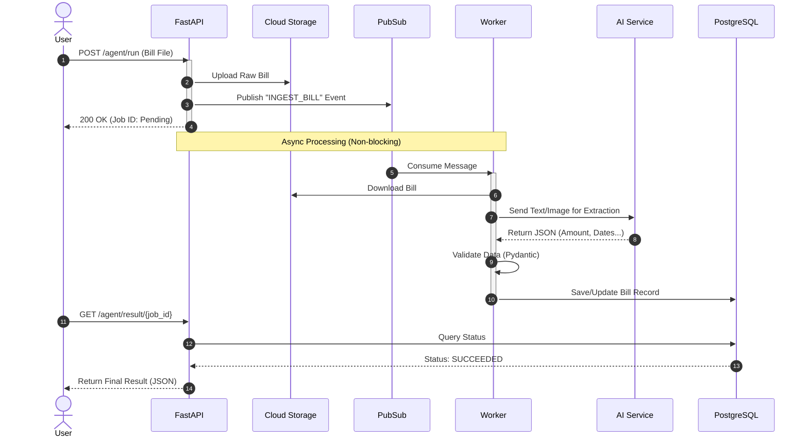

# System Architecture Diagram

Copy the code below into [Mermaid Live Editor](https://mermaid.live/) to visualize the system.

## 1. High Level Architecture (C4 Style)

```mermaid
graph TD
    %% Styling
    classDef client fill:#f9f,stroke:#333,stroke-width:2px;
    classDef service fill:#bbf,stroke:#333,stroke-width:2px;
    classDef infra fill:#dfd,stroke:#333,stroke-width:2px;
    classDef storage fill:#ff9,stroke:#333,stroke-width:2px;

    User[User / Client] ::: client

    subgraph "Google Cloud Platform"
        API[FastAPI Service<br/>(Cloud Run)] ::: service
        Worker[Worker Service<br/>(Cloud Run)] ::: service
        
        PubSub[Pub/Sub<br/>(Message Queue)] ::: infra
        
        DB[(PostgreSQL)] ::: storage
        GCS[(Cloud Storage)] ::: storage
        BQ[(BigQuery)] ::: storage
    end
    
    subgraph "External AI"
        LLM[Gemini / LLM API] ::: infra
    end

    %% Flows
    User -- "1. Upload Bill (HTTP)" --> API
    API -- "2. Save File" --> GCS
    API -- "3. Publish Event" --> PubSub
    
    PubSub -- "4. Trigger" --> Worker
    Worker -- "5. Download File" --> GCS
    Worker -- "6. Extract Data" --> LLM
    LLM -- "7. Return JSON" --> Worker
    
    Worker -- "8. Save Structured Data" --> DB
    Worker -- "9. Archive Analytics" --> BQ
```

## 2. Sequence Diagram (Detailed Flow)


