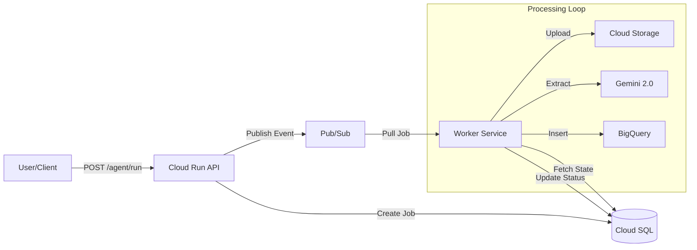

# 🎓 MiniMeter - Mülakat "Cheat Sheet"

Bu belgeyi mülakat sırasında açık tut. Hızlı cevaplar ve "Show & Tell" senaryoları içerir.

---

## 🚀 1. Elevator Pitch (Projeyi Anlat)
**Soru:** "Bize projeden bahset?"

> "MiniMeter, **LLM destekli bir enerji faturası işleme pipeline'ı**. Start-upların yaşadığı 'messy data' problemini çözmek için tasarlandı.
>
> Kullanıcı faturayı sisteme verir, sistem asenkron olarak:
> 1. Faturayı **Cloud Storage**'a yedekler (Audit için).
> 2. **Gemini 2.0 Flash** ile veriyi çıkartır (Extraction).
> 3. **Pydantic** ile veriyi doğrular (Validation).
> 4. Sonuçları operasyonel analiz için **Cloud SQL**'e ve raporlama için **BigQuery**'ye yazar.
>
> Mimari olarak **Event-Driven Microservices** yapısını seçtim çünkü API'nin hızlı yanıt vermesi ve ağır işlerin (LLM) arka planda ölçeklenebilmesi gerekiyordu."

---

## 🖥 2. Show & Tell (Kod Gösterme)

Ekran paylaşımı istenirse bu sırayla git:

### A. "En Temiz Kodum" -> `worker/main.py`
**Vurgula:**
- **Job Lifecycle:** `PENDING` -> `RUNNING` -> `SUCCEEDED` (Satır ~70 `update_job`)
- **Idempotency:** Aynı mesaj iki kere gelirse tekrar işlememesi (`get_job_info` kontrolü).
- **ORM Usage:** Güvenli DB işlemleri (`db.query(...)`, `db.add(...)`).

### B. "Mimari Kararım" -> `shared/database.py` & `orm_models.py`
**Vurgula:**
- **Context Manager:** `with get_db() as db:` yapısı ile otomatik commit/rollback.
- **Shared Models:** API ve Worker aynı modelleri kullanıyor, duplication yok.

### C. "LLM Entegrasyonu" -> `worker/llm.py` & `eval/run.py`
**Vurgula:**
- **Provider Context:** LLM'e "Bu bir PG&E faturası" diyerek accuracy arttırma.
- **Eval Set:** Kodunu değiştirdiğimde accuracy bozulmasın diye yazdığım test seti (`eval/bills/`).

---

## 🛡 3. Zor Sorular & Cevaplar

| Soru | Cevap (Kısa) | Detay |
|------|--------------|-------|
| **Neden Pub/Sub?** | Decoupling & Reliability | "API düşse bile mesajlar kaybolmaz (durability). Worker sayısını arttırarak processing hızını scale edebilirim." |
| **Neden GCS?** | Unstructured Data Storage | "Veritabanı text/blob saklamak için pahalı. Orijinal faturayı GCS'de tutup sadece linkini DB'ye koymak best practice." |
| **Neden ORM?** | Security & Maintainability | "Raw SQL injection'a açık olabilir. SQLAlchemy type safety sağlıyor ve DB değişimini (Postgres -> MySQL) kolaylaştırıyor." |
| **LLM Yanlış Okursa?** | Pydantic Validation | "LLM çıktısını `BillNormalized` şeması ile zorluyorum. Format yanlışsa kod hata fırlatır ve job `FAILED` olur." |
| **Scale Edersen?** | Caching + Async | "LLM çağrıları için Redis cache eklerim. Worker sayısını horizontal scale ederim (K8s/Cloud Run)." |

---

## 📊 4. Mimari Şema (Gözünün Önünde Olsun)



---

## 📈 5. Future Scaling Roadmap (10 → 10k Customers)

"Bu sistemi nasıl 10,000 müşteriye scale edersin?" sorusuna verilecek yapılandırılmış cevap.

### A. Infrastructure (Compute)
*   **Şimdi:** Cloud Run (API) + VM (veya tek Worker).
*   **Next Step:** **Cloud Run Jobs** veya **K8s (GKE)**.
    *   Worker'ları stateless hale getirdik, bu yüzden yatay olarak (horizontal scaling) kolayca N adet worker çalıştırabiliriz.
    *   Job queue partitioning: Customer ID'ye göre farklı Pub/Sub topic'lerine bölerek "noisy neighbor" problemini önleriz.

### B. Database (Storage)
*   **Şimdi:** Tek Cloud SQL instance.
*   **Next Step:** **Connection Pooling** (PgBouncer) + **Read Replicas**.
    *   Yazma işlemi (INSERT) asenkron olduğu için DB'yi kilitlemez ama okuma işlemleri (Dashboard) artarsa Read Replica ekleriz.
    *   Analitik sorgular zaten BigQuery'de olduğu için ana DB rahat.

### C. LLM Optimization (Cost & Latency)
*   **Şimdi:** Her fatura için Gemini API çağrısı (~2sn).
*   **Next Step:** **Caching** + **Batching**.
    *   **Semantic Caching:** Aynı faturayı tekrar gönderirlerse embedding kontrolü ile cache'den döneriz.
    *   **Fine-tuning:** Sık gelen fatura formatları (örn: PG&E) için daha küçük ve hızlı bir model (Gemini Flash veya Llama 3) fine-tune edip maliyeti %90 düşürürüz.

### D. Architecture (Reliability)
*   **Şimdi:** Tek region.
*   **Next Step:** **Multi-Region** + **Dead Letter Queues (DLQ)**.
    *   Pub/Sub'da 5 kez başarısız olan işleri DLQ'ya atıp, insan incelemesine (human-in-the-loop) sunan bir dashboard ekleriz.

---

## ⚡️ 6. Demo İsterlerse

Hazır komutlar:

**1. Job Başlat:**
```bash
curl -X POST "https://minimeter-api-787646377501.us-central1.run.app/agent/run?utility_account_id=1"
```

**2. Sonucu Göster:**
```bash
# ID'yi güncelle: /agent/result/10
curl https://minimeter-api-787646377501.us-central1.run.app/agent/result/10
```
