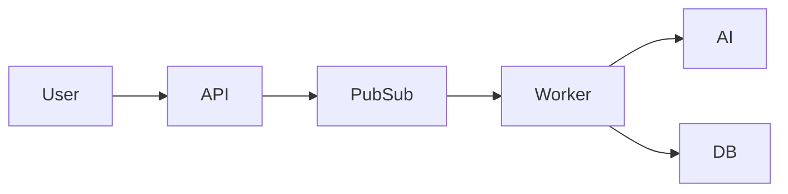
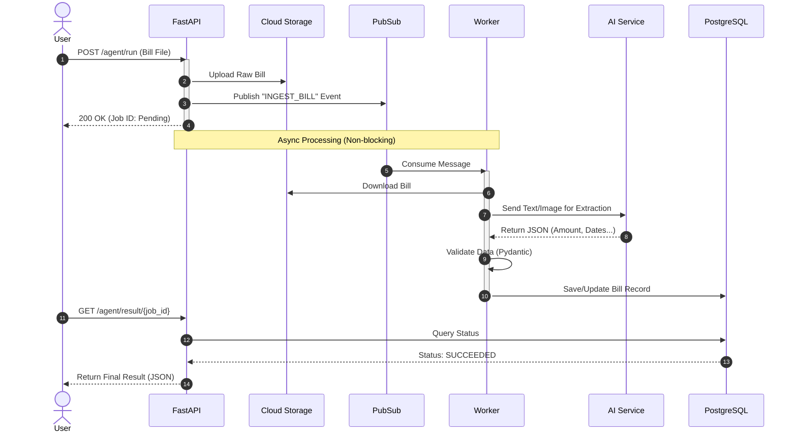

# System Architecture Diagram

Copy the code below into [Mermaid Live Editor](https://mermaid.live/) to visualize the system.

## 1. High Level Architecture (ASCII)

```text
       [ USER ]
          |
     (Upload Bill)
          |
          v
+-------------------------------------------------------+
| GOOGLE CLOUD PLATFORM                                 |
|                                                       |
|   [ API Service ] ----> [ Cloud Storage (Raw) ]       |
|         |                                             |
|         v                                             |
|   [ Pub/Sub Queue ]                                   |
|         |                                             |
|         v                                             |
|   [ Worker Service ] <----> [ Gemini AI (LLM) ]       |
|         |                                             |
|         +----> [ PostgreSQL (App DB) ]                |
|         |                                             |
|         +----> [ BigQuery (Analytics) ]               |
|                                                       |
+-------------------------------------------------------+
```

## 2. Mermaid (Simplified)
If you want to try Mermaid again, here is a simpler version without custom styling:



## 2. Sequence Diagram (Detailed Flow)


